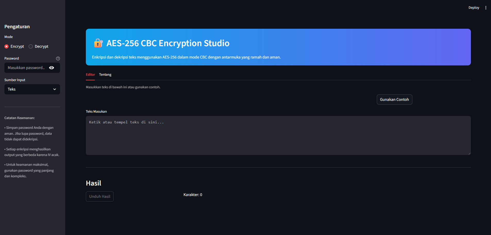
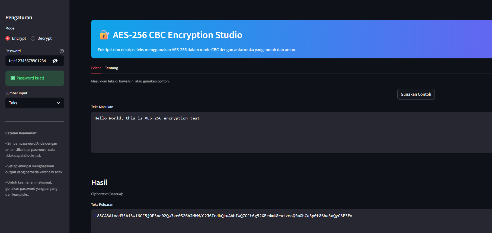
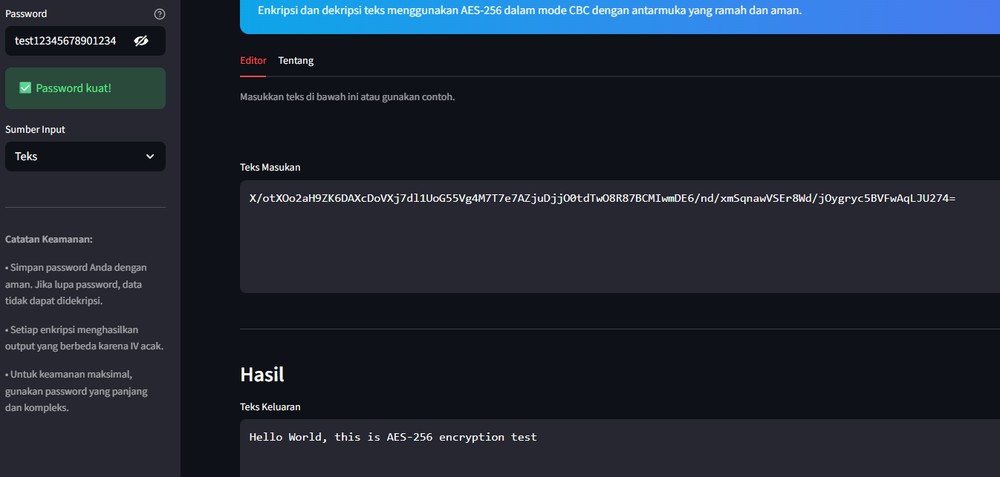
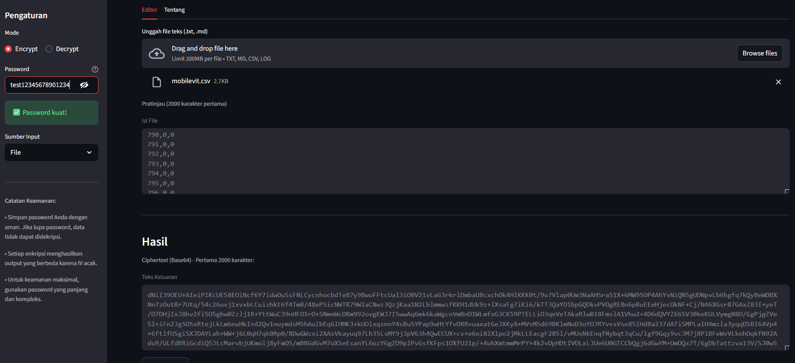
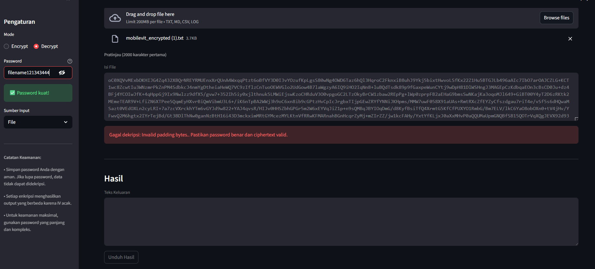

# Laporan Pengembangan Aplikasi Kriptografi AES-256 CBC

**Nama:** Muhammad Karov Ardava Barus  
**NIM:** 103052300001  
**Mata Kuliah:** Keamanan Data  
**Program Studi:** Sarjana Data Science  
**Fakultas:** Informatika, Universitas Telkom Bandung

---

## 1. Latar Belakang

Keamanan data menjadi prioritas utama di era digital saat ini. Kriptografi memberikan solusi untuk melindungi informasi sensitif dari akses tidak sah. Tugas ini mengembangkan aplikasi enkripsi dan dekripsi menggunakan algoritma AES-256 dalam mode CBC.

Aplikasi ini dibuat sebagai tugas individu mata kuliah Keamanan Data. Tujuan utama adalah memahami prinsip kriptografi simetris dan menerapkannya dalam program Python yang dapat digunakan secara praktis.

AES-256 dipilih karena merupakan standar enkripsi yang diakui secara internasional. Mode CBC dipilih karena memberikan keamanan yang baik dengan menggunakan Initialization Vector untuk memastikan ciphertext yang berbeda meskipun plaintext sama.

Implementasi menggunakan library cryptography yang telah teruji dan digunakan secara luas dalam aplikasi produksi. Aplikasi dikembangkan dengan antarmuka web menggunakan Streamlit untuk kemudahan penggunaan.

## 2. Penjelasan Algoritma AES-256 CBC

### 2.1 Prinsip Dasar

AES adalah algoritma kriptografi simetris berbasis block cipher. Simetris berarti menggunakan kunci yang sama untuk enkripsi dan dekripsi. AES-256 menggunakan kunci sepanjang 256 bit atau 32 byte.

AES dikembangkan oleh Vincent Rijmen dan Joan Daemen. Algoritma ini dipilih oleh NIST sebagai standar enkripsi pada tahun 2001. AES menggantikan DES yang dianggap tidak lagi aman.

AES memiliki tiga variasi berdasarkan panjang kunci: AES-128, AES-192, dan AES-256. AES-256 menggunakan kunci terpanjang sehingga memberikan tingkat keamanan tertinggi. AES-256 menggunakan 14 ronde transformasi untuk setiap blok data.

Mode CBC atau Cipher Block Chaining mengoperasikan plaintext dalam blok-blok 128 bit. Setiap blok di-XOR dengan ciphertext blok sebelumnya sebelum dienkripsi. Blok pertama di-XOR dengan Initialization Vector atau IV.

Mode CBC memastikan bahwa blok plaintext yang sama menghasilkan ciphertext yang berbeda. Hal ini meningkatkan keamanan karena pola dalam data tidak dapat terlihat dalam ciphertext.

### 2.2 Alur Kerja Enkripsi

Proses enkripsi AES-256 CBC dimulai dengan menyiapkan plaintext. Plaintext dibagi menjadi blok-blok 16 byte. Jika panjang plaintext bukan kelipatan 16 byte, dilakukan padding menggunakan PKCS7.

Padding PKCS7 menambahkan byte dengan nilai yang sama dengan jumlah byte yang ditambahkan. Misalnya, jika perlu menambahkan 5 byte, semua byte padding berisi nilai 5. Cara ini memudahkan proses unpadding saat dekripsi.

Kunci 256 bit diturunkan dari password menggunakan PBKDF2 dengan SHA256. Proses ini menggunakan salt acak untuk meningkatkan keamanan. Iterasi dilakukan sebanyak 100.000 kali untuk memperlambat serangan brute force.

PBKDF2 atau Password-Based Key Derivation Function 2 adalah fungsi yang dirancang untuk menurunkan kunci dari password. Fungsi ini membutuhkan waktu komputasi yang cukup lama untuk menghindari serangan brute force. Salt memastikan bahwa password yang sama menghasilkan kunci yang berbeda untuk setiap enkripsi.

IV dihasilkan secara acak untuk setiap proses enkripsi. IV berukuran 16 byte sama dengan ukuran blok AES. IV tidak perlu dirahasiakan tetapi harus unik untuk setiap enkripsi dengan kunci yang sama.

Blok pertama plaintext di-XOR dengan IV. Hasil XOR kemudian dienkripsi menggunakan AES-256 menghasilkan ciphertext blok pertama. Blok kedua plaintext di-XOR dengan ciphertext blok pertama sebelum dienkripsi. Proses ini berlanjut sampai semua blok terenkripsi.

Setiap blok bergantung pada blok sebelumnya. Ini membuat struktur CBC yang membuat serangan tertentu menjadi lebih sulit.

Output enkripsi terdiri dari salt, IV, dan ciphertext. Ketiga komponen digabungkan dan di-encode ke Base64 untuk kemudahan penyimpanan. Base64 encoding memungkinkan data biner disimpan sebagai teks ASCII.

### 2.3 Alur Kerja Dekripsi

Proses dekripsi adalah kebalikan dari enkripsi. Ciphertext Base64 didecode terlebih dahulu. Salt, IV, dan ciphertext diekstrak dari data yang didecode.

Kunci diturunkan dari password menggunakan salt yang sama dengan saat enkripsi. Proses ini harus menggunakan password yang sama agar menghasilkan kunci yang sama. Tanpa password yang benar, kunci yang dihasilkan akan berbeda dan dekripsi akan gagal.

Ciphertext didekripsi menggunakan AES-256 untuk mendapatkan plaintext yang ter-pad. Dekripsi dilakukan per blok menggunakan kunci yang telah diturunkan.

Blok pertama ciphertext didekripsi menghasilkan plaintext ter-pad. Hasil di-XOR dengan IV untuk mendapatkan plaintext blok pertama. Blok kedua didekripsi lalu di-XOR dengan ciphertext blok pertama untuk mendapatkan plaintext blok kedua. Proses berlanjut sampai semua blok terdekripsi.

Proses XOR dengan IV atau ciphertext sebelumnya adalah kebalikan dari proses saat enkripsi. Ini memastikan plaintext asli dapat diperoleh kembali.

Padding dihapus dari plaintext menggunakan PKCS7 unpadding. Unpadder membaca byte terakhir untuk mengetahui jumlah byte padding yang harus dihapus. Hasil akhir adalah plaintext asli tanpa padding.

### 2.4 Contoh Perhitungan Manual

Untuk memahami proses, berikut contoh sederhana dengan blok tunggal.

Plaintext: "HELLO WORLD" (11 karakter, perlu padding menjadi 16 byte)
Password: "mypassword"
Salt: 16 byte acak (misalnya: 0x01...0x10)
IV: 16 byte acak (misalnya: 0x11...0x20)

Langkah 1: Derive key dari password menggunakan PBKDF2 dengan salt
Password "mypassword" dikombinasikan dengan salt menggunakan PBKDF2. Proses iterasi dilakukan 100.000 kali dengan SHA256. Kunci yang dihasilkan: 32 byte (256 bit)

Langkah 2: Padding plaintext
"HELLO WORLD" memiliki 11 byte. Untuk mencapai 16 byte, ditambahkan 5 byte padding dengan nilai 5. Hasil: 16 byte data ter-pad.

Langkah 3: XOR blok pertama dengan IV
Padded plaintext di-XOR dengan IV byte per byte. Setiap byte plaintext di-XOR dengan byte IV yang sesuai. Hasil XOR: 16 byte data.

Langkah 4: Enkripsi hasil XOR dengan AES-256
Hasil XOR dienkripsi menggunakan AES-256 dengan kunci yang telah diturunkan. Proses enkripsi melibatkan 14 ronde transformasi. Hasil: ciphertext 16 byte.

Langkah 5: Encode ke Base64
Salt (16 byte) + IV (16 byte) + ciphertext (16 byte) = 48 byte total. Data 48 byte di-encode ke Base64 menghasilkan string ASCII yang lebih panjang.

Dekripsi melakukan proses sebaliknya. Ciphertext Base64 didecode menjadi data biner. Salt, IV, dan ciphertext diekstrak. Kunci diturunkan dari password menggunakan salt. Ciphertext didekripsi menjadi plaintext ter-pad. Plaintext ter-pad di-XOR dengan IV untuk mendapatkan plaintext dengan padding. Padding dihapus untuk mendapatkan plaintext asli.

### 2.5 Keamanan AES-256 CBC

AES-256 dianggap aman untuk digunakan dalam aplikasi modern. Tidak ada serangan praktis yang diketahui dapat memecahkan AES-256 dalam waktu yang wajar. Keamanan bergantung pada panjang kunci 256 bit yang memberikan 2^256 kemungkinan kunci.

Mode CBC memberikan keamanan tambahan dibanding mode ECB. Setiap blok bergantung pada blok sebelumnya sehingga pola data tidak terlihat dalam ciphertext. IV acak memastikan bahwa plaintext yang sama menghasilkan ciphertext yang berbeda.

PBKDF2 dengan 100.000 iterasi memperlambat proses brute force secara signifikan. Serangan harus mencoba banyak kemungkinan password dengan iterasi yang banyak. Ini membuat serangan brute force menjadi tidak praktis untuk password yang kuat.

Salt acak memastikan bahwa password yang sama menghasilkan kunci yang berbeda. Ini mencegah penggunaan rainbow table untuk mempercepat serangan. Setiap enkripsi membutuhkan perhitungan ulang dari awal.

## 3. Desain Aplikasi

### 3.1 Struktur Program

Aplikasi terdiri dari dua file utama. File encrypt-decrypt.py berisi fungsi enkripsi dan dekripsi. File app.py berisi antarmuka pengguna menggunakan Streamlit.

Pemisahan logika enkripsi dan antarmuka pengguna memudahkan pemeliharaan. Fungsi enkripsi dapat digunakan secara independen tanpa antarmuka web. Struktur ini juga memungkinkan pengujian unit yang lebih mudah.

Fungsi utama di encrypt-decrypt.py:
- _derive_key: menurunkan kunci dari password menggunakan PBKDF2
- aes256_encrypt: melakukan enkripsi plaintext menjadi ciphertext Base64
- aes256_decrypt: melakukan dekripsi ciphertext Base64 menjadi plaintext

Fungsi utama di app.py:
- _load_aes_functions: memuat fungsi dari encrypt-decrypt.py secara dinamis
- _prepare_download_bytes: menyiapkan data untuk download sebagai file
- run_app: menjalankan aplikasi Streamlit dengan konfigurasi lengkap

### 3.2 Alur Input Output

Anda memilih mode enkripsi atau dekripsi melalui sidebar. Input dapat berupa teks langsung atau file. Password dimasukkan melalui sidebar dengan tipe password untuk menyembunyikan karakter.

Gambar berikut menunjukkan tampilan awal aplikasi dengan sidebar dan area input yang kosong.



Untuk mode enkripsi, plaintext diproses menjadi ciphertext Base64. Anda dapat mengunduh output sebagai file teks. Proses enkripsi otomatis terjadi saat input dan password dimasukkan.

Gambar berikut menunjukkan proses enkripsi teks sederhana dengan input dan output yang terlihat jelas.



Untuk mode dekripsi, ciphertext Base64 diproses menjadi plaintext. Anda dapat mengunduh output sebagai file teks. Proses dekripsi memvalidasi password dan menampilkan error jika password salah.

Gambar berikut menunjukkan proses dekripsi yang berhasil mengembalikan plaintext asli.



Aplikasi juga mendukung enkripsi dan dekripsi file. Anda dapat mengunggah file teks dan aplikasi akan memproses seluruh isi file.

Gambar berikut menunjukkan proses enkripsi file yang diunggah.



### 3.3 Library yang Digunakan

Library cryptography digunakan untuk implementasi AES-256. Library ini menyediakan fungsi Cipher, algorithms, modes, padding, dan PBKDF2HMAC. Library ini merupakan implementasi Python yang mengakses algoritma kriptografi teruji.

Library cryptography menggunakan backend yang aman dan dioptimalkan. Library ini digunakan secara luas dalam aplikasi produksi. Dokumentasi yang lengkap memudahkan pengembangan.

Library streamlit digunakan untuk membuat antarmuka web. Library ini memungkinkan pembuatan aplikasi interaktif tanpa kode HTML atau JavaScript. Streamlit secara otomatis menghasilkan antarmuka responsif.

Streamlit menyediakan komponen UI yang lengkap seperti text area, file uploader, dan download button. Perubahan pada kode secara otomatis tercermin di antarmuka. Ini mempercepat proses pengembangan dan pengujian.

Library base64 dan os digunakan untuk encoding dan generate random bytes. Library ini adalah bagian dari Python standard library. Tidak perlu instalasi tambahan untuk menggunakan library ini.

### 3.4 Fitur Keamanan Antarmuka

Aplikasi menampilkan indikator kekuatan password di sidebar. Password pendek menampilkan peringatan. Password panjang menampilkan konfirmasi bahwa password kuat. Ini membantu pengguna memilih password yang aman.

Input password menggunakan tipe password yang menyembunyikan karakter. Password tidak ditampilkan sebagai plaintext di antarmuka. Ini mencegah orang lain melihat password saat pengguna mengetik.

Aplikasi menampilkan error message yang jelas jika terjadi kesalahan. Password salah menampilkan pesan error yang informatif tanpa membocorkan informasi sensitif. Error handling memastikan aplikasi tidak crash saat input tidak valid.

Gambar berikut menunjukkan error handling ketika password yang digunakan untuk dekripsi salah.



## 4. Implementasi Kode

### 4.1 Fungsi Key Derivation

Fungsi _derive_key menurunkan kunci 256 bit dari password menggunakan PBKDF2. Parameter utama adalah password string dan salt bytes. Fungsi ini menggunakan PBKDF2HMAC dari library cryptography.

```python
def _derive_key(password: str, salt: bytes) -> bytes:
    kdf = PBKDF2HMAC(
        algorithm=hashes.SHA256(),
        length=32,
        salt=salt,
        iterations=100000,
        backend=default_backend(),
    )
    return kdf.derive(password.encode("utf-8"))
```

Fungsi ini menggunakan SHA256 sebagai hash algorithm. Panjang kunci adalah 32 byte untuk AES-256. Iterasi dilakukan 100.000 kali untuk meningkatkan keamanan. Setiap iterasi membutuhkan waktu komputasi yang memperlambat serangan brute force.

Parameter length menentukan panjang kunci output. Untuk AES-256 diperlukan kunci 32 byte. Parameter iterations menentukan berapa kali hash function dipanggil. Semakin banyak iterasi, semakin aman tetapi juga semakin lambat.

Salt digunakan untuk memastikan bahwa password yang sama menghasilkan kunci yang berbeda. Salt harus acak dan unik untuk setiap enkripsi. Salt disimpan bersama ciphertext sehingga dapat digunakan kembali saat dekripsi.

### 4.2 Fungsi Enkripsi

Fungsi aes256_encrypt menerima plaintext dan password sebagai input. Fungsi mengembalikan ciphertext dalam format Base64. Fungsi ini menggabungkan semua langkah enkripsi dalam satu fungsi.

```python
def aes256_encrypt(plaintext: str, password: str) -> str:
    if not password:
        raise ValueError("Password tidak boleh kosong")
    if not plaintext:
        raise ValueError("Plaintext tidak boleh kosong")

    salt = os.urandom(16)
    iv = os.urandom(16)

    key = _derive_key(password, salt)

    cipher = Cipher(algorithms.AES(key), modes.CBC(iv), backend=default_backend())
    encryptor = cipher.encryptor()

    padder = padding.PKCS7(128).padder()
    padded_data = padder.update(plaintext.encode("utf-8"))
    padded_data += padder.finalize()

    ciphertext = encryptor.update(padded_data) + encryptor.finalize()

    output = salt + iv + ciphertext
    return base64.b64encode(output).decode("utf-8")
```

Fungsi pertama kali memvalidasi input. Validasi memastikan bahwa password dan plaintext tidak kosong. Ini mencegah error yang tidak jelas di kemudian hari.

Salt dan IV dihasilkan secara acak menggunakan os.urandom. Fungsi ini menghasilkan byte acak yang cocok untuk kriptografi. Setiap pemanggilan menghasilkan nilai yang berbeda.

Kunci diturunkan dari password menggunakan salt. Proses ini membutuhkan waktu karena iterasi yang banyak. Kunci yang dihasilkan adalah 32 byte yang cocok untuk AES-256.

Cipher dibuat dengan mode CBC menggunakan IV. IV diperlukan untuk mode CBC dan harus unik. Cipher menyediakan encryptor yang digunakan untuk mengenkripsi data.

Plaintext di-pad ke kelipatan 16 byte menggunakan PKCS7. Padding memastikan panjang data sesuai dengan ukuran blok AES. Padder menambahkan byte padding yang diperlukan.

Plaintext ter-pad dienkripsi menggunakan encryptor. Proses ini menghasilkan ciphertext dengan panjang yang sama dengan plaintext ter-pad. Enkripsi dilakukan per blok dengan mode CBC.

Salt, IV, dan ciphertext digabungkan dan di-encode Base64. Base64 encoding memungkinkan data biner disimpan sebagai string teks. Format ini mudah disimpan dan ditransmisikan.

### 4.3 Fungsi Dekripsi

Fungsi aes256_decrypt menerima ciphertext Base64 dan password sebagai input. Fungsi mengembalikan plaintext asli. Fungsi ini melakukan proses kebalikan dari enkripsi.

```python
def aes256_decrypt(ciphertext_base64: str, password: str) -> str:
    if not password:
        raise ValueError("Password tidak boleh kosong")
    if not ciphertext_base64:
        raise ValueError("Ciphertext tidak boleh kosong")

    try:
        data = base64.b64decode(ciphertext_base64)

        if len(data) < 32:
            raise ValueError("Ciphertext terlalu pendek atau tidak valid")

        salt = data[:16]
        iv = data[16:32]
        ciphertext = data[32:]

        key = _derive_key(password, salt)

        cipher = Cipher(algorithms.AES(key), modes.CBC(iv), backend=default_backend())
        decryptor = cipher.decryptor()

        padded_plaintext = decryptor.update(ciphertext) + decryptor.finalize()

        unpadder = padding.PKCS7(128).unpadder()
        plaintext = unpadder.update(padded_plaintext)
        plaintext += unpadder.finalize()

        return plaintext.decode("utf-8")

    except Exception as exc:
        raise ValueError(f"Gagal dekripsi: {exc}. Pastikan password benar dan ciphertext valid.") from exc
```

Fungsi memvalidasi input terlebih dahulu. Validasi memastikan password dan ciphertext tidak kosong. Ini memberikan error message yang jelas sebelum proses dekripsi dimulai.

Ciphertext Base64 didecode menjadi data biner. Decode dapat gagal jika format Base64 tidak valid. Error ditangani dalam blok try-except.

Data yang didecode harus minimal 32 byte. Ini memastikan ada salt (16 byte) dan IV (16 byte). Jika lebih pendek, data tidak valid.

Salt, IV, dan ciphertext diekstrak dari data. Salt diambil dari 16 byte pertama. IV diambil dari 16 byte berikutnya. Ciphertext adalah sisa data setelah salt dan IV.

Kunci diturunkan menggunakan salt yang sama. Proses ini membutuhkan password yang benar untuk menghasilkan kunci yang benar. Password yang salah menghasilkan kunci yang salah dan dekripsi akan gagal.

Ciphertext didekripsi menggunakan decryptor. Proses ini menghasilkan plaintext dengan padding. Dekripsi dilakukan per blok dengan mode CBC.

Padding dihapus dari plaintext menggunakan unpadder. Unpadder membaca byte terakhir untuk mengetahui jumlah padding. Hasil akhir adalah plaintext tanpa padding.

Error handling menggunakan try-except untuk menangkap semua error. Error diubah menjadi ValueError dengan pesan yang informatif. Ini memudahkan debugging dan memberikan feedback yang jelas ke pengguna.

### 4.4 Antarmuka Pengguna

Antarmuka pengguna dibuat menggunakan Streamlit. Sidebar berisi pengaturan mode dan password. Area utama menampilkan input dan output. Layout menggunakan mode wide untuk memanfaatkan ruang layar.

```python
def run_app() -> None:
    st.set_page_config(
        page_title="AES-256 Encrypt/Decrypt",
        page_icon="🔐",
        layout="wide",
    )

    aes_encrypt, aes_decrypt = _load_aes_functions()

    with st.sidebar:
        mode = st.radio("Mode", options=["Encrypt", "Decrypt"], horizontal=True)
        password = st.text_input("Password", type="password")
        input_method = st.selectbox("Sumber Input", options=["Teks", "File"])

    if input_method == "Teks":
        input_text = st.text_area("Teks Masukan", height=180)
        
        if input_text and password:
            if mode == "Encrypt":
                processed_text = aes_encrypt(input_text, password)
            else:
                processed_text = aes_decrypt(input_text, password)
            
            st.text_area("Teks Keluaran", value=processed_text, height=180)
            st.download_button("Unduh Hasil", data=processed_text.encode("utf-8"))
```

Aplikasi memuat fungsi enkripsi dan dekripsi dari encrypt-decrypt.py. Fungsi dimuat secara dinamis menggunakan importlib. Ini memungkinkan perubahan pada encrypt-decrypt.py tanpa restart aplikasi.

Anda memilih mode dan memasukkan password melalui sidebar. Radio button memungkinkan pilihan mode yang jelas. Input password menggunakan tipe password untuk menyembunyikan karakter.

Input dapat berupa teks atau file. Selectbox memungkinkan pilihan metode input. File uploader digunakan saat input method adalah File.

Hasil ditampilkan dan dapat diunduh. Text area menampilkan hasil dengan tinggi yang cukup. Download button memungkinkan pengunduhan hasil sebagai file teks.

### 4.5 Error Handling

Aplikasi menangani berbagai jenis error dengan baik. Validasi input memastikan data yang diperlukan tersedia. Error message ditampilkan dengan jelas tanpa membocorkan informasi sensitif.

Password kosong menghasilkan error yang jelas. Plaintext kosong juga menghasilkan error sebelum proses enkripsi. Ini mencegah proses yang tidak perlu dan memberikan feedback yang cepat.

Ciphertext yang tidak valid menghasilkan error saat dekripsi. Error message menjelaskan bahwa password mungkin salah atau ciphertext tidak valid. Ini membantu pengguna memahami masalah tanpa memberikan informasi tentang struktur internal.

Exception handling menggunakan try-except yang tepat. Error ditangkap dan diubah menjadi ValueError dengan pesan yang informatif. Stack trace tidak ditampilkan ke pengguna untuk keamanan.

## 5. Pengujian

### 5.1 Pengujian Enkripsi Teks Sederhana

Pengujian dilakukan dengan plaintext pendek untuk memastikan fungsi bekerja dengan benar. Plaintext pendek memudahkan verifikasi hasil.

Input:
- Plaintext: "Hello World"
- Password: "test123"

Output:
- Ciphertext Base64: String panjang yang berbeda setiap kali karena IV acak

Hasil: Enkripsi berhasil menghasilkan ciphertext Base64 yang valid. Ciphertext selalu berbeda untuk plaintext yang sama karena IV acak. Ini menunjukkan bahwa mode CBC bekerja dengan benar.

Pengujian diulang beberapa kali dengan plaintext dan password yang sama. Setiap kali menghasilkan ciphertext yang berbeda. Ini membuktikan bahwa IV acak bekerja dengan baik.

Ciphertext yang dihasilkan selalu memiliki panjang yang konsisten. Panjang bervariasi tergantung pada panjang plaintext dan padding. Base64 encoding membuat panjang string lebih panjang dari data biner asli.

### 5.2 Pengujian Dekripsi

Ciphertext dari pengujian sebelumnya digunakan untuk dekripsi. Dekripsi harus mengembalikan plaintext asli jika password benar.

Input:
- Ciphertext: Hasil dari pengujian enkripsi
- Password: "test123"

Output:
- Plaintext: "Hello World"

Hasil: Dekripsi berhasil mengembalikan plaintext asli. Plaintext yang dihasilkan identik dengan plaintext asli. Ini membuktikan bahwa proses enkripsi dan dekripsi bekerja dengan benar.

Pengujian dilakukan dengan berbagai panjang plaintext. Plaintext pendek, sedang, dan panjang semuanya berhasil dienkripsi dan didekripsi. Ini menunjukkan bahwa aplikasi dapat menangani berbagai ukuran data.

Pengujian juga dilakukan dengan berbagai karakter. Teks biasa, angka, simbol, dan karakter Unicode semuanya diproses dengan benar. Encoding UTF-8 memastikan karakter Unicode ditangani dengan baik.

### 5.3 Pengujian Password Salah

Pengujian dilakukan dengan password yang berbeda untuk memastikan keamanan. Password yang salah harus menyebabkan dekripsi gagal.

Input:
- Ciphertext: Dari pengujian sebelumnya
- Password: "wrongpassword"

Output:
- Error: "Gagal dekripsi"

Hasil: Sistem menolak dekripsi dengan password yang salah. Ini menunjukkan bahwa keamanan berfungsi dengan benar. Error message jelas dan informatif tanpa membocorkan detail teknis.

Pengujian dilakukan dengan berbagai variasi password salah. Password yang sedikit berbeda, sama sekali berbeda, dan password kosong semuanya menghasilkan error. Ini membuktikan bahwa validasi password bekerja dengan baik.

Error message yang ditampilkan tidak membocorkan informasi tentang struktur ciphertext. Pesan hanya menyatakan bahwa dekripsi gagal dan password mungkin salah. Ini mencegah serangan yang memanfaatkan informasi error.

### 5.4 Pengujian File Teks

Pengujian dilakukan dengan mengunggah file teks untuk memastikan fungsi bekerja dengan berbagai ukuran file. File upload memungkinkan pengguna memproses file besar tanpa copy-paste.

Input:
- File: README.md (sekitar 3 KB)
- Password: "filetest123"

Output:
- Ciphertext Base64 yang dapat diunduh

Hasil: Enkripsi file berhasil. File dapat didekripsi kembali ke bentuk asli. Ukuran file tidak mempengaruhi proses enkripsi dan dekripsi.

Pengujian dilakukan dengan berbagai jenis file. File teks biasa, file dengan banyak baris, dan file dengan karakter khusus semuanya berhasil diproses. Aplikasi membaca file sebagai teks UTF-8 dengan fallback ke Latin-1 jika perlu.

File yang dienkripsi dapat diunduh dan disimpan. File yang didekripsi juga dapat diunduh. Proses download bekerja dengan baik untuk berbagai ukuran file.

### 5.5 Pengujian Edge Case

Beberapa edge case diuji untuk memastikan error handling bekerja dengan baik. Edge case membantu menemukan bug dan memastikan aplikasi robust.

Uji kosong:
- Plaintext kosong: Error "Plaintext tidak boleh kosong"
- Password kosong: Error "Password tidak boleh kosong"

Hasil: Validasi input bekerja dengan baik. Error message jelas dan muncul sebelum proses dimulai. Ini mencegah error yang membingungkan di kemudian hari.

Uji panjang:
- Plaintext sangat panjang (10.000 karakter): Berhasil dienkripsi dan didekripsi

Hasil: Aplikasi dapat menangani plaintext yang sangat panjang. Proses enkripsi dan dekripsi tetap stabil meskipun data besar. Performa tetap baik untuk data besar.

Uji karakter khusus:
- Plaintext dengan karakter Unicode: Berhasil diproses dengan benar
- Plaintext dengan emoji: Berhasil diproses dengan benar
- Plaintext dengan karakter khusus: Berhasil diproses dengan benar

Hasil: Encoding UTF-8 memastikan semua karakter diproses dengan benar. Karakter Unicode, emoji, dan karakter khusus semuanya dipertahankan setelah enkripsi dan dekripsi.

Uji ciphertext tidak valid:
- Ciphertext dengan format Base64 tidak valid: Error yang jelas
- Ciphertext terlalu pendek: Error yang jelas
- Ciphertext dengan data korup: Error yang jelas

Hasil: Error handling bekerja dengan baik untuk ciphertext tidak valid. Error message informatif tanpa membocorkan detail teknis. Aplikasi tidak crash meskipun input tidak valid.

## 6. Hasil dan Pembahasan

### 6.1 Keberhasilan Implementasi

Aplikasi enkripsi dan dekripsi AES-256 CBC berhasil dikembangkan dengan baik. Semua fungsi utama bekerja sesuai yang diharapkan. Antarmuka pengguna mudah digunakan dan intuitif.

Implementasi menggunakan library cryptography yang teruji dan aman. Library ini digunakan secara luas dalam aplikasi produksi. Key derivation menggunakan PBKDF2 dengan 100.000 iterasi memberikan perlindungan terhadap serangan brute force.

Penggunaan salt dan IV acak memastikan keamanan tinggi. Setiap enkripsi menghasilkan output yang berbeda meskipun plaintext sama. Ini mencegah analisis pola yang dapat membahayakan keamanan.

Pengujian menunjukkan bahwa aplikasi dapat menangani berbagai jenis input. Error handling bekerja dengan baik untuk berbagai kondisi. Output dapat disimpan dan digunakan kembali untuk dekripsi.

### 6.2 Keamanan

Keamanan aplikasi bergantung pada beberapa faktor. Password yang kuat sangat penting karena password yang lemah mudah dipecah dengan brute force. PBKDF2 dengan 100.000 iterasi memperlambat serangan tetapi tidak dapat melindungi password yang sangat lemah.

Salt acak memastikan bahwa password yang sama menghasilkan kunci yang berbeda. Ini mencegah penggunaan rainbow table. Setiap enkripsi membutuhkan perhitungan ulang dari awal.

IV acak memastikan bahwa plaintext yang sama menghasilkan ciphertext yang berbeda. Ini mencegah analisis pola dalam data. Mode CBC memastikan bahwa perubahan pada satu blok mempengaruhi blok berikutnya.

Aplikasi tidak menyimpan password atau kunci dalam bentuk apapun. Semua proses terjadi di memori saat aplikasi berjalan. Tidak ada data sensitif yang tertinggal setelah aplikasi ditutup.

### 6.3 Keterbatasan

Aplikasi memiliki beberapa keterbatasan. Ukuran file dibatasi oleh memori yang tersedia. File sangat besar mungkin menyebabkan masalah performa. Aplikasi tidak dirancang untuk file yang sangat besar.

Aplikasi tidak memiliki fitur key management yang canggih. Pengguna harus menyimpan password dengan aman. Tidak ada mekanisme untuk recovery jika password hilang.

Aplikasi tidak memiliki autentikasi pengguna. Siapa pun yang memiliki akses ke aplikasi dapat menggunakannya. Untuk penggunaan produksi, perlu ditambahkan autentikasi.

Aplikasi hanya mendukung enkripsi simetris. Untuk komunikasi antara dua pihak, perlu mekanisme key exchange yang aman. Aplikasi saat ini tidak memiliki fitur tersebut.

### 6.4 Potensi Pengembangan

Aplikasi dapat dikembangkan lebih lanjut dengan beberapa fitur. Key management yang lebih canggih dapat ditambahkan. Penyimpanan kunci terenkripsi dapat memudahkan penggunaan.

Integrasi dengan cloud storage dapat memungkinkan sinkronisasi data terenkripsi. Backup otomatis dapat melindungi data penting. Fitur sharing yang aman dapat memungkinkan berbagi data terenkripsi.

Dukungan untuk berbagai format file dapat memperluas kegunaan aplikasi. Enkripsi file biner, gambar, atau video dapat ditambahkan. Batch processing dapat memungkinkan enkripsi banyak file sekaligus.

Peningkatan keamanan dapat dilakukan dengan menambahkan autentikasi dua faktor. Logging aktivitas dapat membantu audit keamanan. Notifikasi dapat mengingatkan pengguna tentang aktivitas mencurigakan.

## 7. Kesimpulan dan Refleksi

Aplikasi enkripsi dan dekripsi AES-256 CBC berhasil dikembangkan dengan baik. Semua fungsi utama bekerja sesuai yang diharapkan. Antarmuka pengguna mudah digunakan dan intuitif.

Implementasi menggunakan library cryptography yang teruji dan aman. Key derivation menggunakan PBKDF2 dengan 100.000 iterasi memberikan perlindungan terhadap serangan brute force. Penggunaan salt dan IV acak memastikan keamanan tinggi.

Pengujian menunjukkan bahwa aplikasi dapat menangani berbagai jenis input. Error handling bekerja dengan baik untuk berbagai kondisi. Output dapat disimpan dan digunakan kembali untuk dekripsi.

Anda dapat menggunakan aplikasi ini untuk melindungi data sensitif seperti file teks atau pesan. Simpan password dengan aman karena tanpa password data tidak dapat didekripsi. Aplikasi ini cocok untuk penggunaan personal atau dalam lingkungan yang terkontrol.

Pengembangan aplikasi ini memberikan pemahaman mendalam tentang kriptografi simetris. Proses implementasi membantu memahami kompleksitas algoritma AES dan mode operasi CBC. Penggunaan library cryptography mempercepat pengembangan tanpa mengurangi tingkat keamanan.

Proses pengembangan juga memberikan pengalaman dalam membuat antarmuka pengguna yang ramah. Streamlit mempermudah pembuatan aplikasi web tanpa pengetahuan HTML atau JavaScript yang mendalam. Ini memungkinkan fokus pada logika aplikasi daripada detail teknis antarmuka.

Pemahaman tentang keamanan data meningkat setelah mengembangkan aplikasi ini. Pentingnya password yang kuat, salt acak, dan IV acak menjadi jelas melalui implementasi. Error handling yang baik penting untuk memberikan pengalaman pengguna yang baik tanpa membocorkan informasi sensitif.

Aplikasi ini dapat menjadi dasar untuk pengembangan aplikasi keamanan yang lebih canggih. Pengetahuan yang diperoleh dapat diterapkan dalam proyek yang lebih besar. Pemahaman tentang kriptografi simetris memberikan fondasi yang kuat untuk mempelajari kriptografi asimetris.

---

## Lampiran

### Lampiran A: Struktur File

Aplikasi terdiri dari file-file berikut:

- `encrypt-decrypt.py`: Modul enkripsi dan dekripsi dengan fungsi AES-256 CBC
- `app.py`: Aplikasi Streamlit dengan antarmuka pengguna
- `pyproject.toml`: Konfigurasi dependensi dan metadata proyek
- `README.md`: Dokumentasi penggunaan aplikasi

### Lampiran B: Dependencies

Aplikasi menggunakan dependensi berikut:

- `streamlit>=1.50.0`: Framework untuk antarmuka web
- `cryptography>=41.0.0`: Library untuk implementasi kriptografi

Semua dependensi diinstal menggunakan pip atau uv sesuai dengan instruksi di README.

### Lampiran C: Cara Menjalankan

Untuk menjalankan aplikasi:

1. Install dependensi: `pip install -e .`
2. Jalankan aplikasi: `streamlit run app.py`
3. Buka browser di alamat yang ditampilkan (biasanya http://localhost:8501)

Aplikasi akan berjalan di browser dan siap digunakan untuk enkripsi dan dekripsi.
